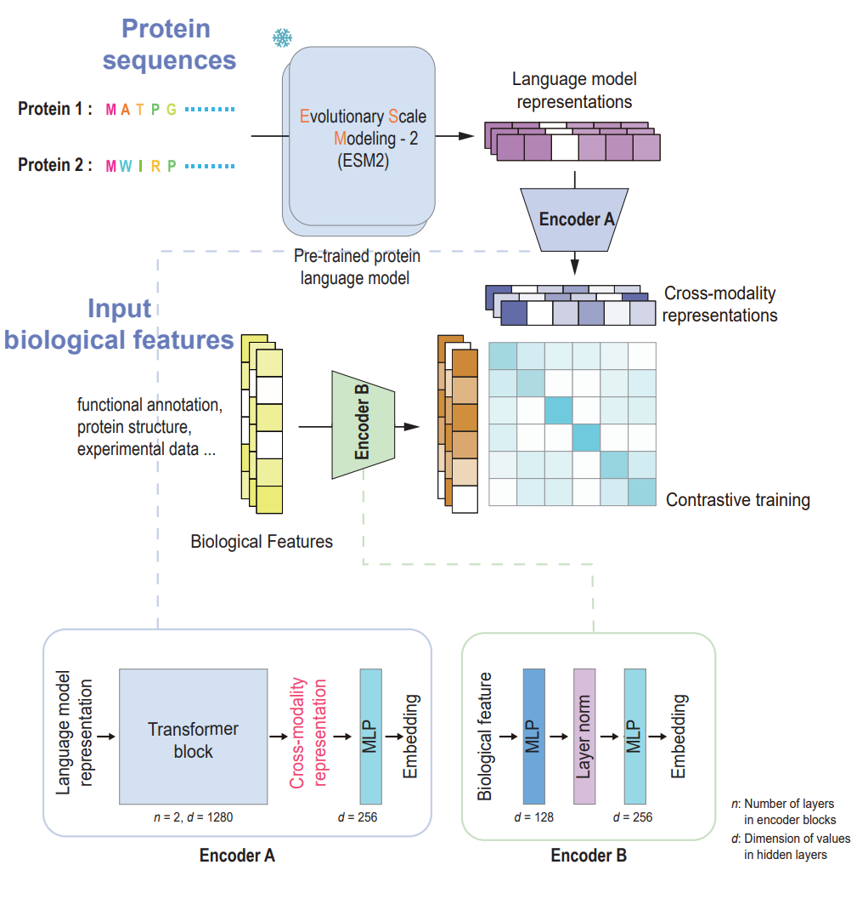

# CLEF
Contrastive Learning of language Embedding and biological Feature is a contrastive learning framework used to combine information from supplemental biological features or experimental data with protein language model [ESM2](https://github.com/facebookresearch/esm) generated embeddings. Generated cross-modal feature can be used for better downstream protein prediction like Gram-negative bacterial effectors prediction or virulence factors discovery.




## Set up

### Requirement
The project is implemented with python (3.11.3), the following library packages are required:

```txt
torch==2.0.0
fair-esm==2.0.0
biopython==1.83
einops==0.8.0
numpy==1.24.2
scikit-learn==1.2.2
pandas==2.0.3
```
We also tested the code with recent versions of these requirements, other reasonable versions should work as well.
The code was tested on Windows and Ubuntu.

### Installation

Required Python packages are listed in `requirements.txt` file.

To install the required packages, run the following command using pip:
```shell
pip install -r requirements.txt
```


## Demo

CLEF was trained under a contrative learning framework, and can generate cross-modal representations based on pre-trained protein language models (pLMs) of [ESM2](https://github.com/facebookresearch/esm)
The generated cross-modal representations can be used in other downstream predictions task and enhance the protein classification performance.


### Generate Cross-Modal Representation

We provide some example code in `Demo` to use the CLEF, cross-modal representations based on ESM2 can be generated by running `GenerateCrossModalityRep.py`:
```shell
cd .Demo
python GenerateCrossModalityRep.py --In Test_demo.faa --Out Test_demo_clef --weight ..\pretrained_model\Demo_clef_dpc_pssm_encoder.pt --supp_feat_dim 400 
```
 Parameters:

- `--In` fasta file of input proteins.
- `--Out` output protein representation arrays file.
- `--weight` pretrained CLEF model parameters path, here we use the example model `Demo_clef_dpc_pssm_encoder.pt` trained by DPC-PSSM feature in  `pretrained_model`
- `--supp_feat_dim` numbers of dimensions of biological features used for CLEF (need to match with pretrained CLEF model parameters and here is 400)

**Note**: You need to download the pretrained model weights locally to use ESM for protein sequence encoding. You can manually download the ESM2-650M [model](https://dl.fbaipublicfiles.com/fair-esm/models/esm2_t33_650M_UR50D.pt) and [regression](https://dl.fbaipublicfiles.com/fair-esm/regression/esm2_t33_650M_UR50D-contact-regression.pt). Alternatively, `fair-esm` will automatically download the model to `C:\Users\xxx\.cache\torch\hub\checkpoints\`.

This will create a file `Test_demo_clef`, containing the cross-modal representations of input proteins

 ### Predict using the Protein Representation

After that, the generated representations can be used in other protein classification tasks, here we give an example of T6SE prediction:

```shell
python PredictProteinClassification.py --In Test_demo_clef --Out Test_result.xlsx --weight ..\pretrained_model\clef_dpcpssm_T6_classifier.pt
```
Parameters:

- `--In` fasta file of input proteins.
- `--Out` output prediction result Excel table.
- `--weight` classifier weights path, `clef_dpcpssm_T6_classifier.pt` is a simple multilayer perceptron (MLP) trained to discriminate T6SE and non-T6SE

The prediction results will be listed in an Excel table `Test_result.xlsx`.


### Train a CLEF model 

 The core of this framework is provide a simple method to perform cross-modal training between embeddings from language model and other 
 To train a CLEF encoder, you need to prepare `fasta` format files for the protein samples (or encoded 2D-representations) and the corresponding feature files for those proteins. 
Training with different features will yield different CLEF models, generating distinct cross-modal representations that may perform differently in various downstream tasks. 
In our provided demo code, you can input multiple feature vectors of any length (a dict looks like {sample_id:1D numpy array}) for training:

```shell
python CLEFTrain.py --Fa Train_demo.faa --Feat Train_demo_feat --Out Demo_clef --lr 0.0002 --btz 128 --epoch 20
```
Parameters:

- `--Fa` fasta file of input trainset proteins.
- `--Feat` feature array files of input trainset proteins.
- `--Out` output dir containing the training checkpoint.
- `--lr` learning rate for training.
- `--btz` batch size for training for training.
- `--epoch` number of training epoch.

The training log files and the model weights `checkpoint.pt` will be saved in the output directory.

Training the model can be time-consuming and requires adequate hardware support. For example, using an RTX 3060Ti 8GB GPU, training on a dataset of approximately 8,000 proteins for 20 epochs takes around 40 minutes.

## Contact

Please contact Yue Peng at [756028108@qq.com] for questions.


